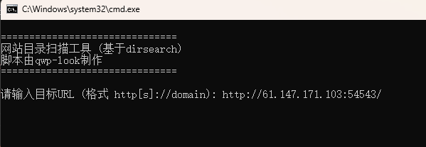

backup
[目地]
掌握有关备份文件的知识

常见的备份文件后缀名有: .git .svn .swp .svn .~ .bak .bash_history

[环境]
windows 11 LTSC

[工具]
edge
dirsearch

[步骤]
1.使用dirsearch进行扫描

2.发现我们需要的文件 （见图4）

3.打开，触发了下载

4.使用记事本打开文件
看见“
<html>
<head>
    <meta charset="UTF-8">
    <title>备份文件</title>
    <link href="http://libs.baidu.com/bootstrap/3.0.3/css/bootstrap.min.css" rel="stylesheet" />
    
</head>
<body>
<h3>你知道index.php的备份文件名吗？</h3>
<?php
$flag="Cyberpeace{855A1C4B3401294CB6604CCC98BDE334}"
?>
</body>
</html>
”
[图片]
1.

2.

3.

4.

5.

6.
[答案]
Cyberpeace{855A1C4B3401294CB6604CCC98BDE334}