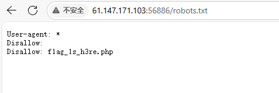
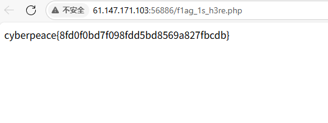

Robots
[原理]
robots.txt是搜索引擎中访问网站的时候要查看的第一个文件。当一个搜索蜘蛛访问一个站点时，它会首先检查该站点根目录下是否存在robots.txt，如果存在，搜索机器人就会按照该文件中的内容来确定访问的范围；如果该文件不存在，所有的搜索蜘蛛将能够访问网站上所有没有被口令保护的页面。

[目地]
掌握robots协议的知识

[环境]
windows 11 LTSC

[工具]
edge

[步骤]
1.了解到robots.txt 通常保存在https://example.com/Robots.txt（可以使用工具dirsearch进行扫描发现）

2.尝试访问，看到"User-agent: *
Disallow: 
Disallow: f1ag_1s_h3re.php"

3.尝试访问 http://61.147.171.103:56886/f1ag_1s_h3re.php

4.成功

[图片]
1.

2.

3.

[答案]
cyberpeace{8fd0f0bd7f098fdd5bd8569a827fbcdb}