# 文件上传漏洞分析

## 原理
浏览器绕过验证。

## 目的
了解文件上传漏洞的利用方式。

## 环境
- **操作系统**: Windows 11 LTSC

## 工具
- **浏览器**: Edge
- **工具**: AntSword

## 步骤
1. 发现这是一个文件上传界面。
2. 查看源码。
3. 尝试上传文件。
4. 发现只允许上传图片文件。
5. 在代码中发现以下逻辑：
   ```javascript
   Array.prototype.contains = function (obj) {  
       var i = this.length;  
       while (i--) {  
           if (this[i] === obj) {  
               return true;  
           }  
       }  
       return false;  
   }  

   function check(){
       upfile = document.getElementById("upfile");
       submit = document.getElementById("submit");
       name = upfile.value;
       ext = name.replace(/^.+\./,'');

       if(['jpg','png'].contains(ext)){
           submit.disabled = false;
       }else{
           submit.disabled = true;
           alert('请选择一张图片文件上传!');
       }
   }
   ```
6. 尝试将 `['jpg','png']` 修改为 `['php']`，上传木马文件。
7. 编写一个 PHP 后门程序（见 `1.php` 或图 4）。
8. 尝试上传文件。
9. 上传失败（见图 5）。
10. 思考：发现文件已经存在（见图 6）。
11. 上传按钮被禁用，无法点击（见图 6）。
12. 通过修改 HTML，将 `disabled` 属性改为 `enabled`（见图 7）。
13. 按钮重新激活，可以点击（见图 8）。
14. 再次尝试上传。
15. 成功上传文件（见图 9）。
16. 使用 AntSword 进行连接（见图 10）。
17. 填写连接信息（见图 11）。
18. 成功连接到目标（见图 12）。
19. 浏览目标文件（见图 13）。
20. 找到 `flag` 文件（见图 14）。
21. 获取最终的 `flag`（见图 15）。

## 图片
1. 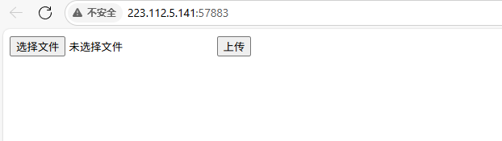
2. 
3. 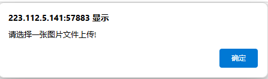
4. 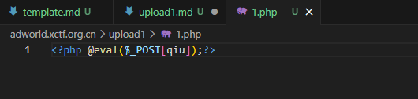
5. 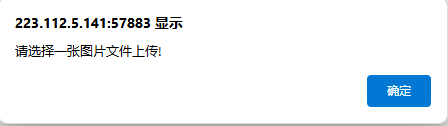
6. 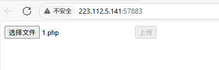
7. 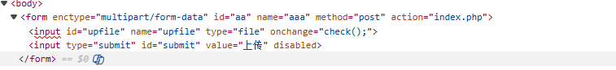
8. 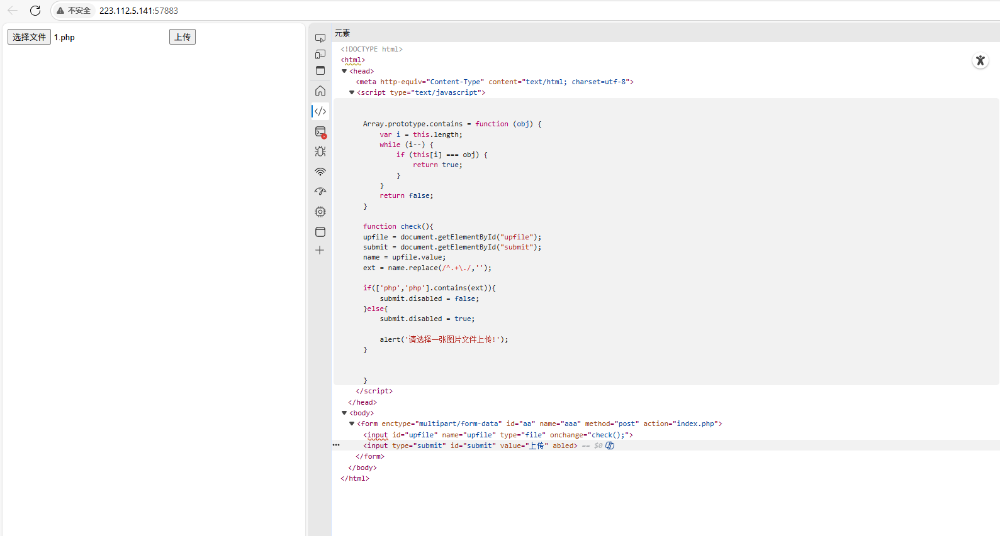
9. 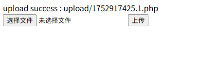
10. 
11. 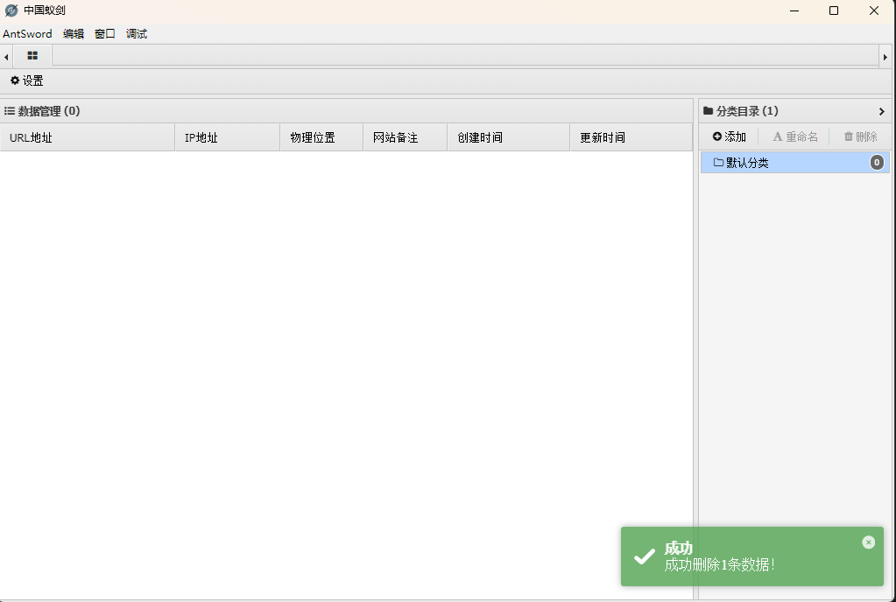
12. 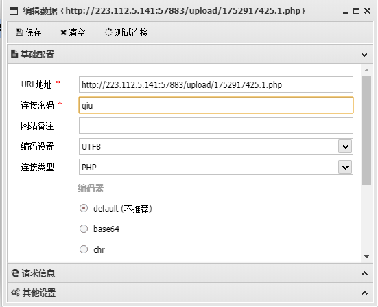
13. 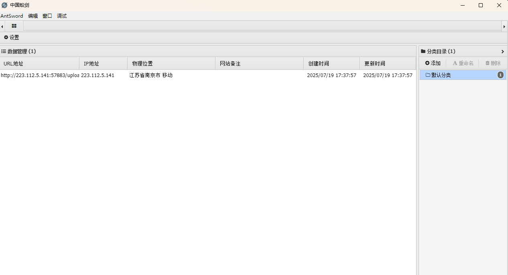
14. 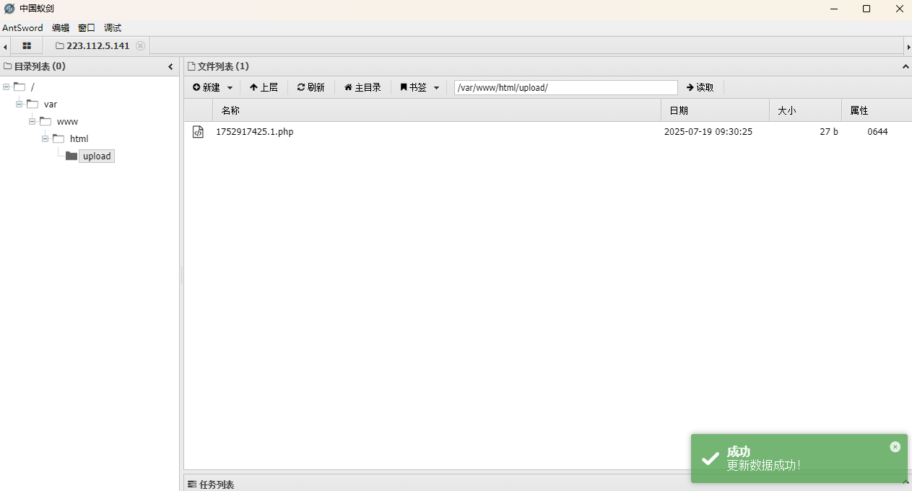
15. 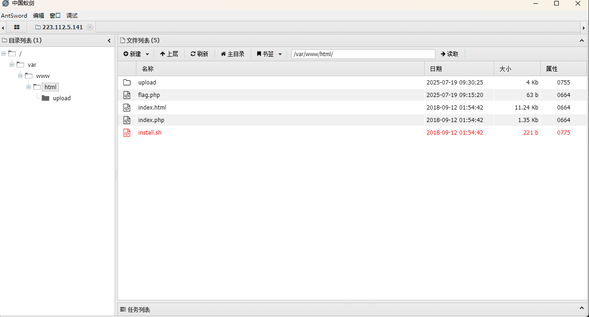

## 答案
`cyberpeace{45bb2e0db6e44c01230c81c98671dbee}`