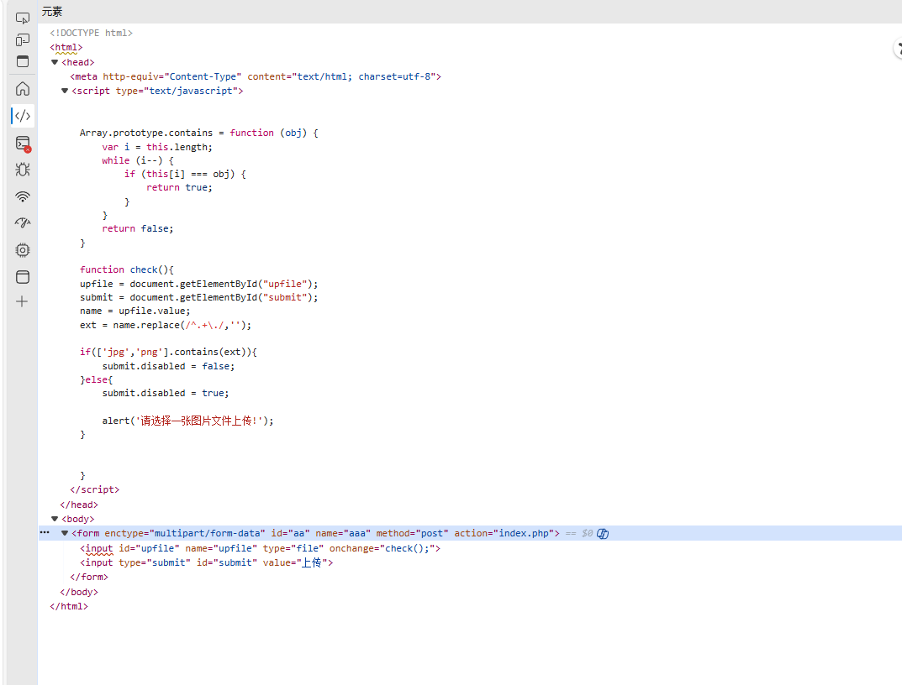
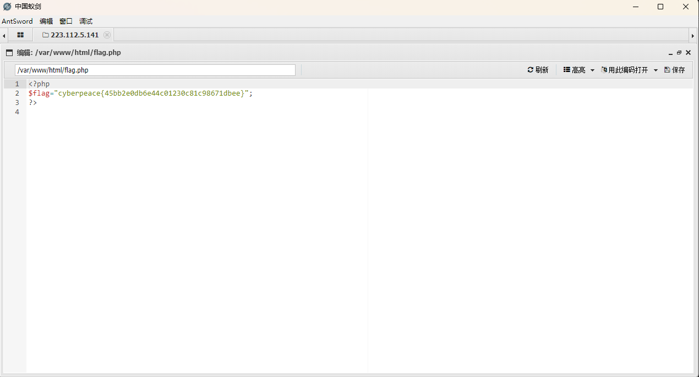

upload1
[原理]
浏览器绕过验证

[目的]
了解文件上传漏洞

[环境]
windows 11 LTSC

[工具]
edge
AntSword

[步骤]
1.发现这是一个文件上传界面

2.查看源码

3.尝试上传

4.发现只允许图片

5.在代码中发现"
 

Array.prototype.contains = function (obj) {  
    var i = this.length;  
    while (i--) {  
        if (this[i] === obj) {  
            return true;  
        }  
    }  
    return false;  
}  

function check(){
upfile = document.getElementById("upfile");
submit = document.getElementById("submit");
name = upfile.value;
ext = name.replace(/^.+\./,'');

if(['jpg','png'].contains(ext)){
	submit.disabled = false;
}else{
	submit.disabled = true;

	alert('请选择一张图片文件上传!');
}

}
"
6.尝试将'jpg','png'改成php，上传木马

7.写一个php后门程序 见1.php 或图4

8.尝试上传

9.失败见图5

10.思考：见到文件已经在那了 见图6

11.想怎么上传，因为上传按钮已经不允许点击了 见图6

12.想到重新激活按钮 见图7

13.将disable 改为able 见图8

14.又可以点了 嘿嘿 见图8

15.试一下

16.成功上传 见图9

17.尝试使用AntSword进行连接 见图10

18.填写内容 见图11

19.成功连接 见图12

20浏览文件 见图13

21发现flag 见图14

22.找到flag 见图15 嘿嘿
[图片]
1.

2.

3.

4.

5.

6.

7.

8.

9.

10.

11.

12.

13.

14.

15.
[答案]
cyberpeace{45bb2e0db6e44c01230c81c98671dbee}